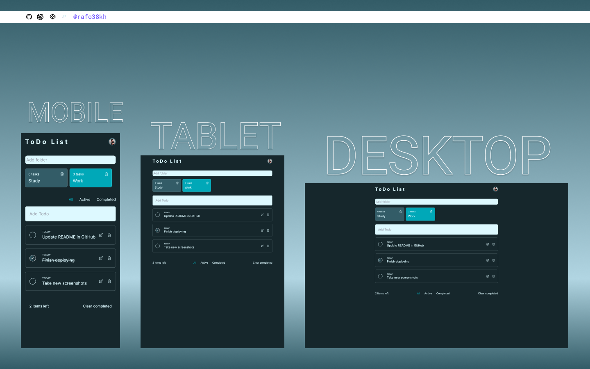

# Frontend Mentor - Todo-App-Main Solution

This is a solution to the [Todo-App-Main Challenge on Frontend Mentor]({https://www.frontendmentor.io/challenges/todo-app-Su1_KokOW})

## Table of contents

- [Overview](#overview)
  - [The challenge](#the-challenge)
  - [Screenshot](#screenshot)
  - [Links](#links)
- [My process](#my-process)
  - [Built with](#built-with)
- [Author](#author)

## Overview

### The challenge

- View the optimal layout for the app depending on their device's screen size
- See hover states for all interactive elements on the page
- Add new todos to the list
- Mark todos as complete
- Delete todos from the list
- Filter by all/active/complete todos
- Clear all completed todos
- Toggle light and dark mode
- **Bonus**: Drag and drop to reorder items on the list

### Screenshot

### Links

- Solution URL: [https://www.frontendmentor.io/solutions/todo-app-with-nextjs-jm5c4kudeg](https://www.frontendmentor.io/solutions/todo-app-with-nextjs-jm5c4kudeg)
- Live Site URL: [https://todo-ouktg4kwy-rafo38kh.vercel.app/](https://todo-ouktg4kwy-rafo38kh.vercel.app/)

## My process

### Built with

- React
- Tailwind CSS
- CSS Flexbox
- Mobile-first workflow

## Author

- Frontend Mentor - [@rafo38kh](https://www.frontendmentor.io/profile/rafo38kh)
- GitHub - [@rafo38kh](https://github.com/rafo38kh)
- Codewars - [@rafo38kh](https://www.codewars.com/users/rafo38kh)
